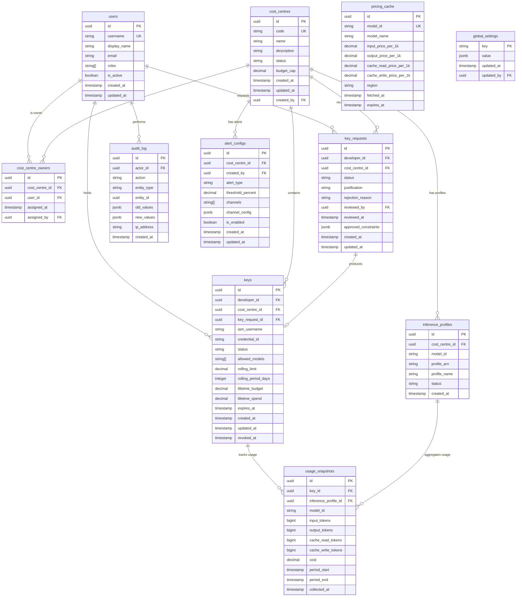

# Data Model

Defines the database schema for the Claude Code AWS Bedrock Manager. This document is the canonical reference for the database layer and serves as the foundation for API specifications, SQLAlchemy models, and Alembic migrations.

**Database:** PostgreSQL
**ORM:** SQLAlchemy
**Migrations:** Alembic

---

## Entity Relationship Diagram



---

## Table Definitions

### `users`

Platform users. A user can hold multiple roles simultaneously.

| Column | Type | Constraints | Description |
|--------|------|-------------|-------------|
| `id` | `UUID` | PK, default `gen_random_uuid()` | Primary key |
| `username` | `VARCHAR(100)` | UNIQUE, NOT NULL | Login username (SSO subject in production, hardcoded in PoC) |
| `display_name` | `VARCHAR(255)` | NOT NULL | Human-readable name |
| `email` | `VARCHAR(255)` | UNIQUE, NOT NULL | Email address for notifications |
| `password_hash` | `VARCHAR(255)` | NULL | Bcrypt hash (PoC only; NULL when using SSO) |
| `roles` | `VARCHAR(20)[]` | NOT NULL, default `'{developer}'` | Array of roles: `admin`, `developer`, `cco` |
| `is_active` | `BOOLEAN` | NOT NULL, default `TRUE` | FALSE when deactivated (SSO offboarding disables all keys) |
| `created_at` | `TIMESTAMPTZ` | NOT NULL, default `NOW()` | |
| `updated_at` | `TIMESTAMPTZ` | NOT NULL, default `NOW()` | Auto-updated on change |

**Indexes:**
- `idx_users_username` — UNIQUE on `username`
- `idx_users_email` — UNIQUE on `email`
- `idx_users_is_active` — for filtering active users

**Notes:**
- Roles are stored as a PostgreSQL array rather than a separate join table — the set of roles is small and fixed (`admin`, `developer`, `cco`).
- When `is_active` is set to FALSE, all keys owned by this user must be disabled (enforced by application logic).

---

### `cost_centres`

Organisational budget unit. Represents a project, team, or department that owns a budget for Claude Code usage.

| Column | Type | Constraints | Description |
|--------|------|-------------|-------------|
| `id` | `UUID` | PK, default `gen_random_uuid()` | Primary key |
| `code` | `VARCHAR(50)` | UNIQUE, NOT NULL | Short unique code (e.g., `CC-1234`) |
| `name` | `VARCHAR(255)` | NOT NULL | Human-readable name |
| `description` | `TEXT` | NULL | Optional description |
| `status` | `VARCHAR(20)` | NOT NULL, default `'active'` | `active`, `archived` |
| `budget_cap` | `DECIMAL(12,2)` | NULL | Total dollar cap across all keys in this cost centre. NULL = no cap. |
| `created_at` | `TIMESTAMPTZ` | NOT NULL, default `NOW()` | |
| `updated_at` | `TIMESTAMPTZ` | NOT NULL, default `NOW()` | |
| `created_by` | `UUID` | FK → `users.id`, NOT NULL | Admin who created it |

**Indexes:**
- `idx_cost_centres_code` — UNIQUE on `code`
- `idx_cost_centres_status` — for filtering active/archived

**Status transitions:**
- `active` → `archived` (CCO or Admin archives; all keys disabled, pending requests auto-rejected)
- `archived` → `active` (CCO or Admin unarchives; previously active keys restored for active users)

---

### `cost_centre_owners`

Join table mapping users (with `cco` role) to the cost centres they manage. A cost centre can have multiple owners; a user can own multiple cost centres.

| Column | Type | Constraints | Description |
|--------|------|-------------|-------------|
| `id` | `UUID` | PK, default `gen_random_uuid()` | Primary key |
| `cost_centre_id` | `UUID` | FK → `cost_centres.id`, NOT NULL | |
| `user_id` | `UUID` | FK → `users.id`, NOT NULL | |
| `assigned_at` | `TIMESTAMPTZ` | NOT NULL, default `NOW()` | When the assignment was made |
| `assigned_by` | `UUID` | FK → `users.id`, NOT NULL | Admin who made the assignment |

**Indexes:**
- `uq_cost_centre_owners` — UNIQUE on `(cost_centre_id, user_id)`

---

### `key_requests`

Approval workflow record. Created when a developer requests a key; updated when approved or rejected.

| Column | Type | Constraints | Description |
|--------|------|-------------|-------------|
| `id` | `UUID` | PK, default `gen_random_uuid()` | Primary key |
| `developer_id` | `UUID` | FK → `users.id`, NOT NULL | Developer requesting access |
| `cost_centre_id` | `UUID` | FK → `cost_centres.id`, NOT NULL | Target cost centre |
| `status` | `VARCHAR(20)` | NOT NULL, default `'pending'` | `pending`, `approved`, `rejected` |
| `justification` | `TEXT` | NULL | Optional developer-provided reason |
| `rejection_reason` | `TEXT` | NULL | Reason provided by reviewer on rejection |
| `reviewed_by` | `UUID` | FK → `users.id`, NULL | CCO or Admin who reviewed |
| `reviewed_at` | `TIMESTAMPTZ` | NULL | When the review happened |
| `approved_constraints` | `JSONB` | NULL | Constraints set at approval time (see below) |
| `created_at` | `TIMESTAMPTZ` | NOT NULL, default `NOW()` | |
| `updated_at` | `TIMESTAMPTZ` | NOT NULL, default `NOW()` | |

**`approved_constraints` JSONB structure** (populated on approval):
```json
{
  "allowed_models": ["anthropic.claude-sonnet-4-6", "anthropic.claude-haiku-4-5"],
  "rolling_limit": 50.00,
  "rolling_period_days": 7,
  "lifetime_budget": 500.00,
  "expiry_days": 90
}
```

**Indexes:**
- `idx_key_requests_developer` — on `developer_id`
- `idx_key_requests_cost_centre` — on `cost_centre_id`
- `idx_key_requests_status` — on `status` (for listing pending requests)

**Notes:**
- A developer can resubmit after rejection (creates a new `key_requests` row).
- Auto-approved requests (CCO requesting for their own cost centre) are created with `status = 'approved'` and `reviewed_by = developer_id`.

---

### `keys`

Active Bedrock API Key metadata. One row per provisioned key. Bearer tokens are **never stored** — they are displayed once at creation/regeneration.

| Column | Type | Constraints | Description |
|--------|------|-------------|-------------|
| `id` | `UUID` | PK, default `gen_random_uuid()` | Primary key |
| `developer_id` | `UUID` | FK → `users.id`, NOT NULL | Key owner |
| `cost_centre_id` | `UUID` | FK → `cost_centres.id`, NOT NULL | Cost centre this key is billed to |
| `key_request_id` | `UUID` | FK → `key_requests.id`, UNIQUE, NOT NULL | The approval that produced this key |
| `iam_username` | `VARCHAR(255)` | UNIQUE, NOT NULL | AWS IAM username (format: `claude-{username}-{cc_code}`) |
| `credential_id` | `VARCHAR(255)` | UNIQUE, NOT NULL | AWS `ServiceSpecificCredentialId` for lifecycle operations |
| `status` | `VARCHAR(20)` | NOT NULL, default `'active'` | `active`, `stopped`, `expired`, `revoked` |
| `allowed_models` | `VARCHAR(100)[]` | NOT NULL | Models this key can access (e.g., `anthropic.claude-sonnet-4-6`) |
| `rolling_limit` | `DECIMAL(12,2)` | NULL | Cost limit (dollars) over the rolling period. NULL = no rolling limit. |
| `rolling_period_days` | `INTEGER` | NULL | Number of days for the rolling window |
| `lifetime_budget` | `DECIMAL(12,2)` | NULL | Total lifetime spend cap (dollars). NULL = no lifetime cap. |
| `lifetime_spend` | `DECIMAL(12,2)` | NOT NULL, default `0.00` | Accumulated total spend (updated by background scheduler) |
| `expires_at` | `TIMESTAMPTZ` | NULL | Key expiration timestamp. NULL = no expiry. |
| `created_at` | `TIMESTAMPTZ` | NOT NULL, default `NOW()` | |
| `updated_at` | `TIMESTAMPTZ` | NOT NULL, default `NOW()` | |
| `revoked_at` | `TIMESTAMPTZ` | NULL | When the key was revoked (NULL if still active/stopped/expired) |

**Indexes:**
- `idx_keys_developer` — on `developer_id`
- `idx_keys_cost_centre` — on `cost_centre_id`
- `idx_keys_status` — on `status`
- `uq_keys_active_dev_cc` — UNIQUE on `(developer_id, cost_centre_id)` WHERE `status IN ('active', 'stopped')` (enforces one active key per developer per cost centre)

**Status transitions:**
- `active` → `stopped` (rolling/lifetime limit or CC budget exceeded)
- `stopped` → `active` (spend falls outside rolling window, or CC budget increased)
- `active` → `expired` (past `expires_at`)
- `active` / `stopped` → `revoked` (developer, CCO, or Admin revokes)
- `expired` and `revoked` are terminal states

**Notes:**
- No bearer token column — tokens are displayed once and never persisted (see [design.md](design.md) §6).
- `lifetime_spend` is a denormalised running total updated by the background scheduler for fast budget checks.

---

### `inference_profiles`

AWS Application Inference Profiles created by the platform. One per cost centre per model. Used for cost attribution via CloudWatch metrics.

| Column | Type | Constraints | Description |
|--------|------|-------------|-------------|
| `id` | `UUID` | PK, default `gen_random_uuid()` | Primary key |
| `cost_centre_id` | `UUID` | FK → `cost_centres.id`, NOT NULL | Owning cost centre |
| `model_id` | `VARCHAR(100)` | NOT NULL | Bedrock model ID (e.g., `anthropic.claude-sonnet-4-6`) |
| `profile_arn` | `VARCHAR(500)` | UNIQUE, NOT NULL | Full ARN of the inference profile |
| `profile_name` | `VARCHAR(255)` | NOT NULL | AWS profile name (e.g., `cc1234-sonnet`) |
| `status` | `VARCHAR(20)` | NOT NULL, default `'active'` | `active`, `deleted` |
| `created_at` | `TIMESTAMPTZ` | NOT NULL, default `NOW()` | |

**Indexes:**
- `uq_inference_profiles_cc_model` — UNIQUE on `(cost_centre_id, model_id)` WHERE `status = 'active'`
- `idx_inference_profiles_arn` — UNIQUE on `profile_arn`

---

### `usage_snapshots`

Periodic token usage and cost data collected by the background scheduler (every 5 minutes). Each row represents one collection interval for one key against one inference profile.

| Column | Type | Constraints | Description |
|--------|------|-------------|-------------|
| `id` | `UUID` | PK, default `gen_random_uuid()` | Primary key |
| `key_id` | `UUID` | FK → `keys.id`, NOT NULL | Key that generated this usage |
| `inference_profile_id` | `UUID` | FK → `inference_profiles.id`, NOT NULL | Inference profile used |
| `model_id` | `VARCHAR(100)` | NOT NULL | Model ID (denormalised for query convenience) |
| `input_tokens` | `BIGINT` | NOT NULL, default `0` | Input tokens consumed in this period |
| `output_tokens` | `BIGINT` | NOT NULL, default `0` | Output tokens generated in this period |
| `cache_read_tokens` | `BIGINT` | NOT NULL, default `0` | Cache read tokens in this period |
| `cache_write_tokens` | `BIGINT` | NOT NULL, default `0` | Cache write tokens in this period |
| `cost` | `DECIMAL(12,4)` | NOT NULL, default `0.00` | Calculated cost in dollars (tokens × pricing) |
| `period_start` | `TIMESTAMPTZ` | NOT NULL | Start of the collection interval |
| `period_end` | `TIMESTAMPTZ` | NOT NULL | End of the collection interval |
| `collected_at` | `TIMESTAMPTZ` | NOT NULL, default `NOW()` | When this snapshot was recorded |

**Indexes:**
- `idx_usage_key_period` — on `(key_id, period_start)` for rolling-window budget calculations
- `idx_usage_profile_period` — on `(inference_profile_id, period_start)` for CC-level aggregation
- `idx_usage_collected_at` — on `collected_at` for data retention queries

**Notes:**
- Rolling-period budget enforcement queries: `SELECT SUM(cost) FROM usage_snapshots WHERE key_id = ? AND period_start >= NOW() - INTERVAL '? days'`
- CC-level budget enforcement aggregates across all keys in the cost centre.
- Older snapshots may be aggregated/archived for performance (future optimisation).

---

### `pricing_cache`

Cached model pricing from AWS Price List API. Refreshed daily by the background scheduler. Hardcoded seed values for PoC.

| Column | Type | Constraints | Description |
|--------|------|-------------|-------------|
| `id` | `UUID` | PK, default `gen_random_uuid()` | Primary key |
| `model_id` | `VARCHAR(100)` | UNIQUE, NOT NULL | Bedrock model ID |
| `model_name` | `VARCHAR(255)` | NOT NULL | Human-readable name (e.g., "Claude Sonnet 4") |
| `input_price_per_1k` | `DECIMAL(10,6)` | NOT NULL | Price per 1,000 input tokens (USD) |
| `output_price_per_1k` | `DECIMAL(10,6)` | NOT NULL | Price per 1,000 output tokens (USD) |
| `cache_read_price_per_1k` | `DECIMAL(10,6)` | NULL | Price per 1,000 cache read tokens (USD) |
| `cache_write_price_per_1k` | `DECIMAL(10,6)` | NULL | Price per 1,000 cache write tokens (USD) |
| `region` | `VARCHAR(50)` | NOT NULL, default `'ap-southeast-2'` | AWS region |
| `fetched_at` | `TIMESTAMPTZ` | NOT NULL, default `NOW()` | When pricing was last fetched |
| `expires_at` | `TIMESTAMPTZ` | NOT NULL | When this cached entry should be refreshed |

---

### `alert_configs`

Configurable alert rules per cost centre. CCOs define thresholds and notification channels.

| Column | Type | Constraints | Description |
|--------|------|-------------|-------------|
| `id` | `UUID` | PK, default `gen_random_uuid()` | Primary key |
| `cost_centre_id` | `UUID` | FK → `cost_centres.id`, NOT NULL | Cost centre this alert applies to |
| `created_by` | `UUID` | FK → `users.id`, NOT NULL | CCO who created the alert |
| `alert_type` | `VARCHAR(50)` | NOT NULL | Type of alert (see enum below) |
| `threshold_percent` | `DECIMAL(5,2)` | NULL | Percentage threshold (e.g., `80.00` for 80%). NULL for non-threshold alerts. |
| `channels` | `VARCHAR(20)[]` | NOT NULL | Notification channels: `email`, `slack` |
| `channel_config` | `JSONB` | NULL | Channel-specific configuration (see below) |
| `is_enabled` | `BOOLEAN` | NOT NULL, default `TRUE` | Whether this alert is active |
| `created_at` | `TIMESTAMPTZ` | NOT NULL, default `NOW()` | |
| `updated_at` | `TIMESTAMPTZ` | NOT NULL, default `NOW()` | |

**`alert_type` values:**
| Value | Description |
|-------|-------------|
| `cc_budget_threshold` | Cost centre budget usage hit X% |
| `developer_limit_threshold` | Individual developer exceeded X% of their key limit |
| `usage_spike` | Abnormal usage pattern detected |
| `key_expiry_reminder` | Key approaching expiration |
| `new_key_request` | New key request submitted for this cost centre |

**`channel_config` JSONB structure:**
```json
{
  "email_recipients": ["cco@example.com", "finance@example.com"],
  "slack_channel": "#cc-1234-alerts",
  "slack_webhook_url": "https://hooks.slack.com/services/..."
}
```

**Indexes:**
- `idx_alert_configs_cc` — on `cost_centre_id`
- `idx_alert_configs_type` — on `alert_type`

---

### `audit_log`

Immutable append-only log of all state-changing actions. Retained indefinitely. Accessible to Administrators only.

| Column | Type | Constraints | Description |
|--------|------|-------------|-------------|
| `id` | `UUID` | PK, default `gen_random_uuid()` | Primary key |
| `actor_id` | `UUID` | FK → `users.id`, NULL | User who performed the action (NULL for system actions) |
| `action` | `VARCHAR(100)` | NOT NULL | Action performed (see enum below) |
| `entity_type` | `VARCHAR(50)` | NOT NULL | Type of entity affected |
| `entity_id` | `UUID` | NULL | ID of the affected entity |
| `old_values` | `JSONB` | NULL | Previous state (for updates) |
| `new_values` | `JSONB` | NULL | New state (for creates/updates) |
| `ip_address` | `INET` | NULL | Client IP address |
| `created_at` | `TIMESTAMPTZ` | NOT NULL, default `NOW()` | |

**`action` values (non-exhaustive):**
| Action | Entity Type | Description |
|--------|-------------|-------------|
| `user.created` | `user` | New user registered/created |
| `user.deactivated` | `user` | User deactivated (SSO offboarding) |
| `cost_centre.created` | `cost_centre` | New cost centre created |
| `cost_centre.archived` | `cost_centre` | Cost centre archived |
| `cost_centre.unarchived` | `cost_centre` | Cost centre unarchived |
| `cost_centre.budget_updated` | `cost_centre` | Budget cap changed |
| `cco.assigned` | `cost_centre_owner` | CCO assigned to cost centre |
| `cco.removed` | `cost_centre_owner` | CCO removed from cost centre |
| `key.requested` | `key_request` | Developer requested a key |
| `key.approved` | `key_request` | Key request approved |
| `key.rejected` | `key_request` | Key request rejected |
| `key.provisioned` | `key` | AWS resources created, key active |
| `key.revoked` | `key` | Key revoked (by dev, CCO, or Admin) |
| `key.stopped` | `key` | Key stopped (limit reached) |
| `key.restarted` | `key` | Key re-enabled (spend fell outside window) |
| `key.expired` | `key` | Key expired |
| `key.regenerated` | `key` | Key credentials regenerated |
| `key.constraints_updated` | `key` | CCO modified key constraints |
| `settings.updated` | `global_settings` | Global setting changed |
| `model.restriction_updated` | `global_settings` | Global model restrictions changed |

**Indexes:**
- `idx_audit_log_actor` — on `actor_id`
- `idx_audit_log_entity` — on `(entity_type, entity_id)`
- `idx_audit_log_action` — on `action`
- `idx_audit_log_created_at` — on `created_at` (for time-range queries)

**Notes:**
- This table is append-only. No updates or deletes.
- Consider partitioning by `created_at` for long-term performance.

---

### `global_settings`

Key-value store for platform-wide configuration. Managed by Administrators.

| Column | Type | Constraints | Description |
|--------|------|-------------|-------------|
| `key` | `VARCHAR(100)` | PK | Setting identifier |
| `value` | `JSONB` | NOT NULL | Setting value |
| `updated_at` | `TIMESTAMPTZ` | NOT NULL, default `NOW()` | |
| `updated_by` | `UUID` | FK → `users.id`, NULL | Admin who last changed it (NULL for defaults) |

**Seed values:**

| Key | Example Value | Description |
|-----|---------------|-------------|
| `aws_region` | `"ap-southeast-2"` | Target AWS region |
| `allowed_models` | `["anthropic.claude-sonnet-4-6", "anthropic.claude-haiku-4-5"]` | Globally allowed models |
| `default_key_expiry_days` | `90` | Default key expiration (days) |
| `default_rolling_limit` | `{"amount": 50.00, "period_days": 7}` | Default per-key rolling limit |
| `default_lifetime_budget` | `500.00` | Default per-key lifetime budget |
| `slack_workspace_url` | `"https://myorg.slack.com"` | Slack workspace for notifications |

---

## Constraints Summary

| Business Rule | Enforcement |
|---------------|-------------|
| One active key per developer per cost centre | Partial unique index on `keys(developer_id, cost_centre_id)` WHERE `status IN ('active', 'stopped')` |
| CCO auto-approval for own cost centre | Application logic: if developer is CCO for selected CC, set `key_requests.status = 'approved'` and `reviewed_by = developer_id` |
| Key constraints set at approval time | `key_requests.approved_constraints` JSONB copied to `keys` columns on provisioning |
| CC budget cap stops all keys | Background scheduler: if `SUM(usage_snapshots.cost)` for CC ≥ `cost_centres.budget_cap`, disable all CC keys |
| Per-key rolling limit | Background scheduler: if rolling-window spend ≥ `keys.rolling_limit`, set key status to `stopped` |
| Deactivated user → all keys disabled | Application logic on `users.is_active = FALSE` |
| Archived CC → all keys disabled, pending requests rejected | Application logic on `cost_centres.status = 'archived'` |
| Bearer tokens never stored | No token column in `keys`; token returned only via API response |

---

## Related Documents

- [Requirements](REQUIREMENTS.md) — Functional and non-functional requirements
- [Design](design.md) — Architecture, containers, and key flows
- [Design Decisions](design-decisions.md) — Rationale for credential strategy, cost tracking, and model restrictions
