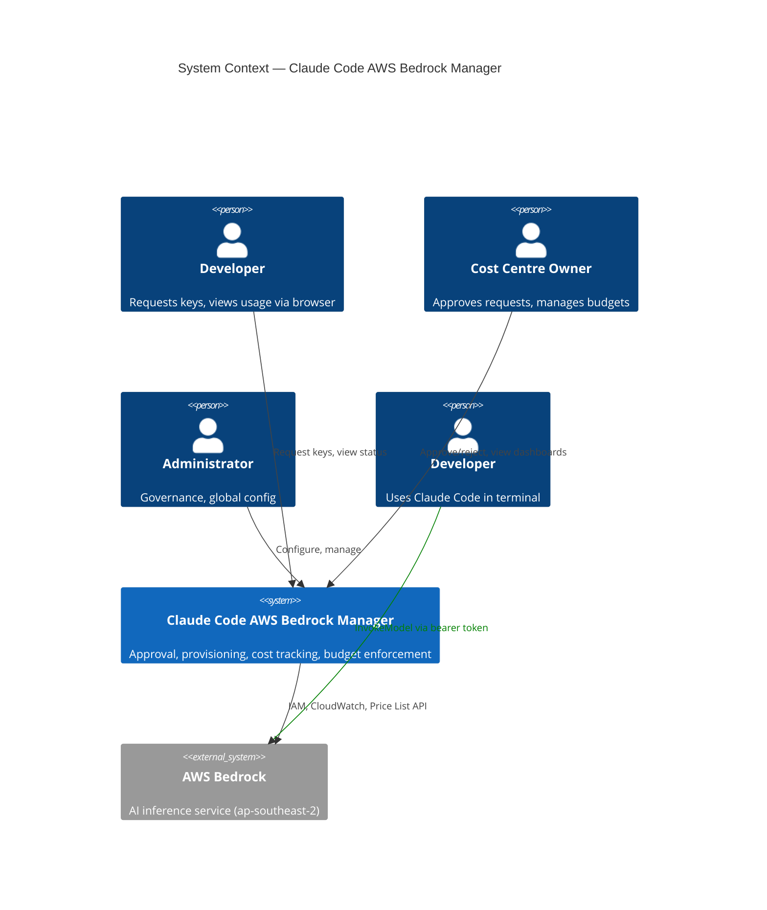
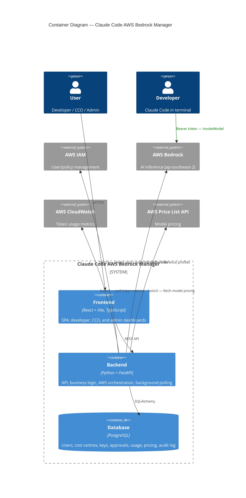
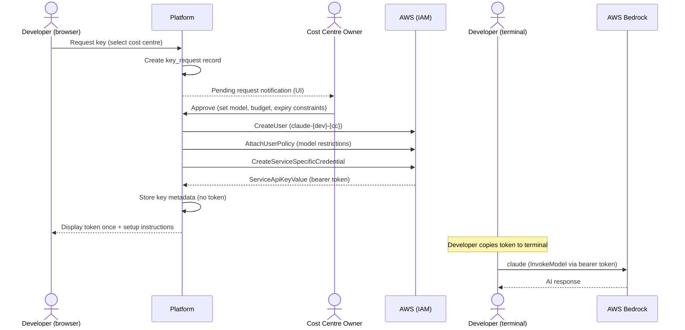
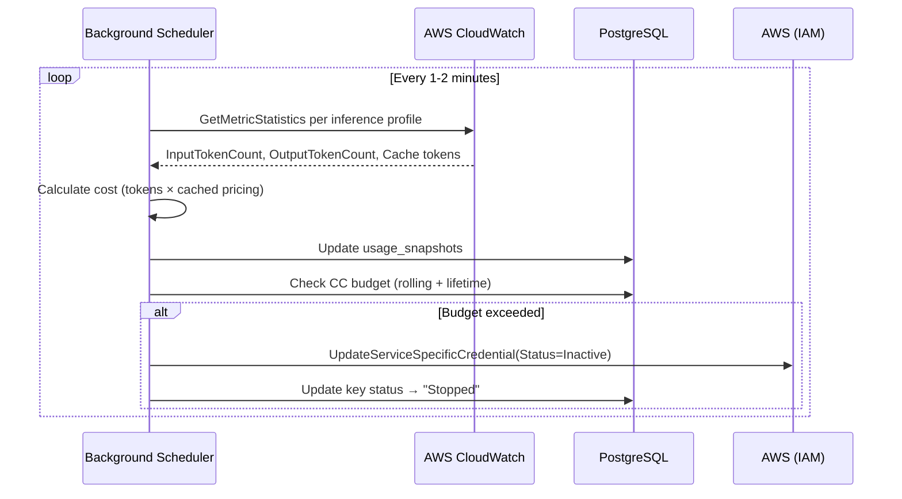
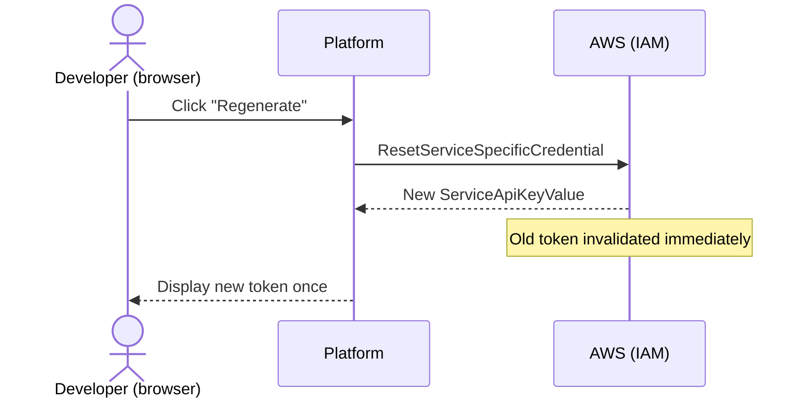

# Claude Code AWS Bedrock Manager — Design

## 1. Overview

A self-service web application that automates the provisioning, lifecycle management, and cost governance of Claude Code access via AWS Bedrock. The platform sits between developers who need Claude Code and the AWS Bedrock infrastructure that hosts it, providing a controlled approval and budget enforcement layer.

### System Context (C4 Level 1)



**Users** interact via the web UI to request keys, approve requests, and view dashboards.
**The platform** orchestrates AWS resources (IAM users, policies, Bedrock API Keys, inference profiles) and polls CloudWatch for usage data.
**Developers** use the provisioned bearer token in their terminal to run Claude Code, which calls AWS Bedrock directly. The platform does not sit in this path — it only provisions and governs the credentials.
**AWS Bedrock** is the AI inference service that developers call via Claude Code.

---

## 2. Container Diagram (C4 Level 2)



### Containers

| Container | Technology | Purpose |
|-----------|------------|---------|
| **Frontend** | React + Vite (TypeScript) | SPA serving developer, CCO, and admin dashboards. Communicates with backend via REST API. |
| **Backend** | Python + FastAPI | API server handling authentication, business logic, AWS orchestration, and background cost polling. |
| **Database** | PostgreSQL | Persistent storage for users, cost centres, key metadata, approvals, usage data, cached pricing, and audit logs. |

### Deployment

- **Local / PoC:** Docker Compose runs all three containers
- **Production:** Docker on ECS; PostgreSQL on RDS/Aurora

---

## 3. Component Descriptions

### 3.1 Frontend (React SPA)

The single-page application serves three role-based views. All users access the same app; the UI adapts based on the authenticated user's role(s).

| View | Users | Key Capabilities |
|------|-------|-------------------|
| **Developer Dashboard** | Developers | Request keys, view key status, copy setup instructions, view usage/spend per key, regenerate lost keys, revoke own keys |
| **CCO Dashboard** | Cost Centre Owners | Approve/reject key requests with constraints (model, budget, expiry), view per-developer usage within their cost centre(s), usage charts and trends, configure budget alert thresholds, archive/unarchive cost centres |
| **Admin Panel** | Administrators | Create cost centres, assign CCOs, manage global model restrictions, view cross-CC usage and cost reports, revoke any key, manage users |

### 3.2 Backend (FastAPI)

The backend is structured into four layers:

#### 3.2.1 API Layer
REST endpoints grouped by domain. Handles authentication (hardcoded users for PoC), request validation (Pydantic), and authorization (role-based access).

**Route groups:**
- `/api/auth` — Login, session management
- `/api/keys` — Request, approve, reject, revoke, regenerate keys
- `/api/cost-centres` — CRUD, archive/unarchive, budget configuration
- `/api/usage` — Usage metrics, cost data, charts data
- `/api/admin` — Global settings, user management, model restrictions

#### 3.2.2 Service Layer
Business logic decoupled from HTTP concerns. Orchestrates the key lifecycle:

- **Key Provisioning Service** — Handles the request → approval → AWS provisioning flow. Creates IAM user, attaches model restriction policies, generates Bedrock API Key via `CreateServiceSpecificCredential`, returns bearer token.
- **Key Lifecycle Service** — Revocation (`UpdateServiceSpecificCredential` → Inactive), regeneration (`ResetServiceSpecificCredential`), expiry handling, and cleanup (`DeleteServiceSpecificCredential` + `DeleteUser`).
- **Cost Tracking Service** — Polls CloudWatch metrics per inference profile, calculates costs using cached pricing, updates usage snapshots in the DB.
- **Budget Enforcement Service** — Compares accumulated cost against rolling-period and lifetime budgets. Disables keys when CC budget is exceeded.
- **Pricing Service** — Fetches model pricing from AWS Price List API (`AmazonBedrockFoundationModels`), caches in DB, refreshes daily.

#### 3.2.3 AWS Integration Layer
Thin wrapper around `boto3` calls. Abstracted behind an interface so it can be swapped for a mock layer during local development.

**AWS services used:**
| Service | Purpose |
|---------|---------|
| **IAM** | Create/delete users, attach/detach policies, create/reset/deactivate service-specific credentials |
| **Bedrock** | Create inference profiles, model access configuration |
| **CloudWatch** | Poll `InputTokenCount`, `OutputTokenCount`, `CacheReadInputTokens`, `CacheWriteInputTokens` per inference profile |
| **Pricing** | Fetch current Bedrock model pricing via Price List Query API |
| **CloudTrail** | Audit trail (read-only — AWS logs automatically per IAM user) |

#### 3.2.4 Background Scheduler
A periodic task (every 1-2 minutes) that:
1. Queries CloudWatch for token metrics per active inference profile
2. Calculates cost using cached pricing rates
3. Updates usage snapshots in the database
4. Checks budgets and disables keys if thresholds are exceeded

### 3.3 Database (PostgreSQL)

Stores all application state. No secrets — bearer tokens are never persisted (displayed once on creation/regeneration).

**Core entities:**

| Entity | Description |
|--------|-------------|
| `users` | Platform users with role assignments (admin, developer, CCO) |
| `cost_centres` | Budget unit with owner assignments, status, budget cap |
| `keys` | Bedrock API Key metadata — IAM username, credential ID, status, expiry, model restrictions. No bearer token stored. |
| `key_requests` | Approval workflow — request, approval/rejection, constraints set by approver |
| `usage_snapshots` | Periodic cost/token data per inference profile, accumulated over rolling periods |
| `pricing_cache` | Current model pricing from AWS Price List API (refreshed daily) |
| `audit_log` | Record of all state-changing actions (who did what, when) |

---

## 4. Key Flows

### 4.1 Key Provisioning (Happy Path)



### 4.2 Budget Enforcement Loop



### 4.3 Key Regeneration



---

## 5. Infrastructure

### 5.1 AWS Account

Dedicated AWS account for Claude Code Bedrock usage (isolated from other workloads).

**Resources managed by the platform:**
- IAM users (one per developer per cost centre, naming: `claude-{dev}-{cc}`)
- IAM policies (model restrictions per user)
- Application inference profiles (one per cost centre)
- CloudWatch metrics (read-only — populated automatically by Bedrock)

### 5.2 Local Development

Docker Compose with three services:

```yaml
services:
  backend:     # FastAPI on port 8000
  frontend:    # React+Vite on port 5173 (proxies /api to backend)
  db:          # PostgreSQL on port 5432
```

Mock AWS layer for local dev; real AWS for integration tests and PoC demo.

---

## 6. Security Considerations

- **No secrets in the database** — bearer tokens are displayed once, never stored
- **Bedrock-scoped credentials** — API keys can only access Bedrock, not S3/EC2/etc
- **IAM policy enforcement** — model restrictions enforced at AWS layer, not app layer
- **Audit trail** — all actions logged in app DB; all Bedrock calls logged in CloudTrail per IAM user
- **PoC auth** — hardcoded users (production: corporate SSO via OIDC/SAML)
- **Key expiration** — built-in via `credential-age-days`; enforceable via SCP

---

## 7. Related Documents

- [Requirements](REQUIREMENTS.md) — Full functional and non-functional requirements
- [Design Decisions](design-decisions.md) — All 11 design decisions with rationale
- [Research](../research/) — Supporting research on AWS Bedrock, IAM, cost tracking, and more
